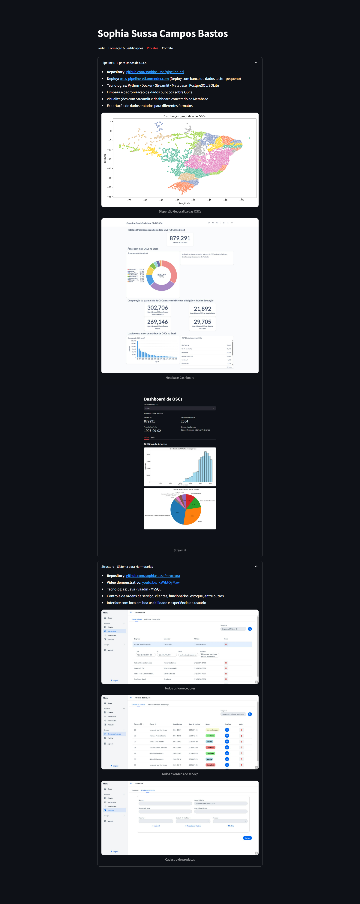

# Portfólio Interativo - Sophia Sussa

Este é meu portfólio online desenvolvido com [Streamlit](https://streamlit.io/), onde apresento meus principais projetos, habilidades técnicas e informações para contato. O objetivo é oferecer uma navegação leve, intuitiva e acessível, com a possibilidade de **baixar meu currículo em PDF** e visualizar **projetos com imagens e links**.

Acesse a versão online: [https://portfolio-nr7nfqqgfj9h432k5ashnq.streamlit.app](https://portfolio-nr7nfqqgfj9h432k5ashnq.streamlit.app)

---

## Interface



---

## Funcionalidades

- **Download do currículo em PDF**
- **Resumo profissional**
- **Habilidades técnicas**
- **Projetos com imagens, descrições e repositórios**
- **Formação, cursos e certificações**
- **Idiomas e atividades de destaque**

---

## Tecnologias Utilizadas

- `Python`
- `Streamlit`
- `Git & GitHub`

---

## 🗂 Estrutura de Pastas

```
📁 portfolio
│
├── assets/
├── img/
├── app.py
├── requirements.txt
└── README.md
```

---

## Como Executar Localmente

1. **Clone o repositório:**

    ```bash
    git clone https://github.com/sophiasussa/portfolio-streamlit.git
    cd portfolio-streamlit

    python -m venv venv

    # Linux/macOS:
    source venv/bin/activate
   
    # Windows:
    venv\Scripts\activate

    pip install -r requirements.txt

    streamlit run app.py
    ```

## Licença

Este projeto está sob a licença [MIT](https://opensource.org/licenses/MIT).
